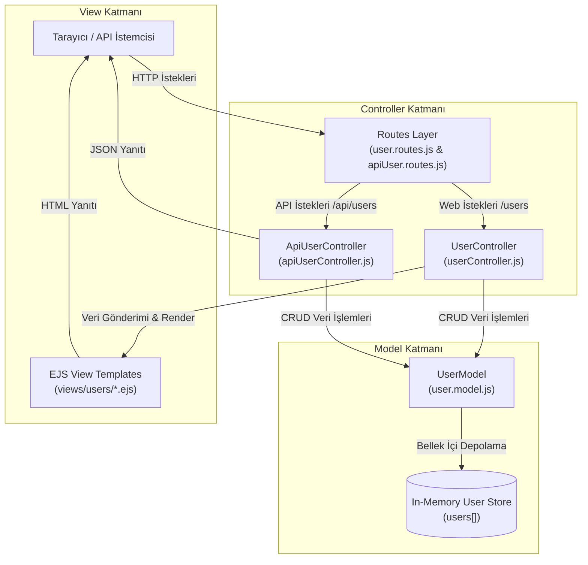

# 🎓 Alumni Tracking System (Mezun Takip Sistemi)

[](https://nodejs.org/)
[](https://expressjs.com/)
[](https://ejs.co/)
[](http://localhost:5000/api/swagger)
[](https://www.docker.com/)
[](https://opensource.org/licenses/MIT)

> **Web Programlama Dersi Dönem Projesi** — Üniversite mezunları, mevcut öğrenciler ve akademisyenleri bir araya getiren, hem **EJS tabanlı dinamik Web Görünüm (View)** katmanına hem de **JSON tabanlı REST API** mimarisine sahip tam teşekküllü **MVC (Model-View-Controller)** web platformu.

---

## 📌 İçindekiler

1. [Proje Özeti ve Temel Özellikler](#-proje-özeti-ve-temel-özellikler)
2. [MVC Mimarisi (Model-View-Controller)](#-mvc-mimarisi-model-view-controller)
   - [Mimari Genel Bakış](#mimari-genel-bakış)
   - [Dizin ve Dosya Hiyerarşisi](#dizin-ve-dosya-hiyerarşisi)
   - [Klasör ve Dosyaların Sorumlulukları](#klasör-ve-dosyaların-sorumlulukları)
   - [İstek Yaşam Döngüsü ve Veri Akışı](#istek-yaşam-döngüsü-ve-veri-akışı)
3. [Kullanıcı Modeli ve In-Memory CRUD](#-kullanıcı-modeli-ve-in-memory-crud)
4. [Kontrolcüler (Controllers)](#-kontrolcüler-controllers)
5. [View Katmanı (EJS Templates)](#-view-katmanı-ejs-templates)
6. [Uç Noktalar ve Rotalar (Endpoints)](#-uç-noktalar-ve-rotalar-endpoints)
7. [Swagger & OpenAPI Dokümantasyonu](#-swagger--openapi-dokümantasyonu)
8. [Kurulum, Çalıştırma ve Testler](#-kurulum-çalıştırma-ve-testler)
9. [Docker Desteği](#-docker-desteği)
10. [Geliştirici Bilgileri](#-geliştirici-bilgileri)

---

## 📌 Proje Özeti ve Temel Özellikler

**Alumni Tracking System**, üniversite mezunlarının kariyer yolculuklarını güncellemelerine, mevcut öğrencilerle mentörlük ve deneyim paylaşımı bağı kurmalarına, staj ve iş imkanlarını paylaşmalarına olanak tanıyan modern bir web uygulamasıdır.

- **👤 Mezun ve Öğrenci Yönetimi:** Profil bilgileri, bölüm, mezuniyet yılı, iletişim ve rol yönetimi (STUDENT, ALUMNI, ADMIN).
- **🖥️ İkili Arayüz Desteği:**
  - **Sunucu Taraflı Görünüm (SSR):** EJS şablonlama motoru ile render edilen zengin ve kullanıcı dostu HTML arayüzü (`/users`).
  - **RESTful JSON API:** Mobil ve harici istemciler için standart JSON yanıtları üreten API uç noktaları (`/api/users`).
- **📚 İnteraktif Swagger Dokümantasyonu:** OpenAPI 3.0 standardında tüm Web ve API uç noktalarını listeleyen ve test imkanı sunan Swagger UI (`/api/swagger`).
- **⚡ In-Memory Veri Modeli:** Harici veritabanı kurulumuna ihtiyaç duymadan tam CRUD işlemlerini destekleyen ve başlangıç örnek verileriyle (seed) gelen model mimarisi.
- **🧪 Otomatik Test Paketi:** Node.js yerleşik test kütüphanesi (`node:test`) ile 18 adet otomatik uçtan uca test senaryosu.

---

## 🏛️ MVC Mimarisi (Model-View-Controller)

Uygulama, yazılım mühendisliği standartlarına uygun olarak sorumlulukların net biçimde ayrıldığı **Model-View-Controller (MVC)** mimari deseniyle tasarlanmıştır.

### Mimari Genel Bakış



---

### Dizin ve Dosya Hiyerarşisi

Projenin dizin ve dosya organizasyonu aşağıda gösterilmiştir:

```plaintext
alumni/
├── index.js                      # Ana uygulama giriş noktası (Web + API sunucusu)
├── package.json                  # Proje bağımlılıkları ve npm betikleri (ES Modules)
├── package-lock.json             # Kilitlenmiş bağımlılık versiyonları
├── Dockerfile                    # Docker imajı yapılandırma dosyası
├── docker-compose.yml            # Docker Compose servis tanımı
├── README.md                     # Kapsamlı proje ve mimari dokümantasyonu
│
├── src/                          # Kaynak kod kök dizini
│   ├── app.js                    # Express app yapılandırması (Middleware'ler, rotalar)
│   ├── server.js                 # Sunucu dinleme ve graceful shutdown yönetimi
│   │
│   ├── config/                   # Yapılandırma katmanı
│   │   ├── environment.js        # Port ve çalışma ortamı değişkenleri
│   │   └── swagger.js            # OpenAPI 3.0 dokümantasyon şeması (Web & API rotaları)
│   │
│   ├── models/                   # MODEL KATMANI (Veri ve İş Mantığı)
│   │   └── user.model.js         # In-memory User modeli ve tam CRUD fonksiyonları
│   │
│   ├── controllers/              # CONTROLLER KATMANI (İstek/Yanıt Yöneticileri)
│   │   ├── userController.js     # Web Görünüm Kontrolcüsü (EJS render eden CRUD)
│   │   ├── apiUserController.js  # REST API Kontrolcüsü (JSON dönen CRUD)
│   │   ├── user.controller.js    # Geriye dönük uyumluluk sarmalayıcısı
│   │   └── health.controller.js  # Sistem sağlık kontrolü kontrolcüsü
│   │
│   └── routes/                   # ROTA KATMANI (URL Eşleştirmeleri)
│       ├── index.js              # API rotaları toplayıcısı ve Swagger mount
│       ├── user.routes.js        # /users Web Görünüm rotaları
│       ├── apiUser.routes.js     # /api/users REST API rotaları
│       └── health.routes.js      # /api/health sistem sağlık rotaları
│
├── views/                        # VIEW KATMANI (EJS Şablonları)
│   ├── error.ejs                 # Genel hata ve 404 sayfası
│   ├── partials/                 # Yeniden kullanılabilir parçalı şablonlar
│   │   ├── header.ejs            # HTML başlık, navigasyon çubuğu ve modern CSS stilleri
│   │   └── footer.ejs            # Sayfa altlığı ve telif/bağlantı alanı
│   └── users/                    # Kullanıcı Yönetimi Görünümleri
│       ├── index.ejs             # [R] Kullanıcı listeleme, arama ve filtreleme tablosu
│       ├── new.ejs               # [C] Yeni kullanıcı oluşturma formu
│       ├── show.ejs              # [R] Tekil kullanıcı detay profil sayfası
│       └── edit.ejs              # [U] Kullanıcı bilgileri düzenleme formu
│
├── public/                       # Statik Web Varlıkları
│   ├── index.html                # Hoş geldiniz ana sayfası ve bağlantı dizini
│   └── about.html                # Proje ve teknoloji yığını hakkında sayfası
│
└── test/                         # Otomatik Test Paketi
    └── index.test.js             # node:test ile yazılmış 18 adet uçtan uca test
```

---

### Klasör ve Dosyaların Sorumlulukları

| Katman / Dizin | Dosya Adı | Rol ve Sorumluluk (Single Responsibility) |
| :--- | :--- | :--- |
| **Model** | `src/models/user.model.js` | Veritabanı bağımsız bellek içi veri deposunu yönetir. E-posta format ve benzersizlik kontrolü, otomatik ID üretimi, zaman damgaları (`created_at`, `updated_at`), filtreleme/arama ve CRUD (`getAll`, `getById`, `getByEmail`, `create`, `update`, `patch`, `delete`) işlevlerini gerçekleştirir. |
| **Controller (Web)** | `src/controllers/userController.js` | Web arayüzü isteklerini karşılar. Modelden veriyi alır, EJS şablonlarını (`render`) çalıştırır, form işlemlerinde yönlendirme (`redirect`) yapar. |
| **Controller (API)** | `src/controllers/apiUserController.js` | Harici istemciler ve API istekleri için HTTP durum kodları (`200 OK`, `201 Created`, `400 Bad Request`, `404 Not Found`, `409 Conflict`) ile biçimlendirilmiş JSON yanıtları döner. |
| **View (EJS)** | `views/users/*.ejs` | Kullanıcının tarayıcıda gördüğü HTML arayüzüdür. Model verisini görselleştirir, kullanıcıdan form girdilerini alır ve aksiyon butonları (Detay, Düzenle, Sil) sunar. |
| **View Partials** | `views/partials/` | `header.ejs` navigasyon ve ortak responsive stilleri, `footer.ejs` alt bilgi ve hızlı bağlantıları içerir. Tüm sayfalarda kod tekrarını önler. |
| **Routes** | `src/routes/user.routes.js` | `/users` altındaki Web isteklerini (GET, POST, PUT, DELETE) `UserController` fonksiyonlarına yönlendirir. |
| **Routes** | `src/routes/apiUser.routes.js` | `/api/users` altındaki REST API isteklerini `ApiUserController` fonksiyonlarına yönlendirir. |
| **Config** | `src/config/swagger.js` | Hem `/users` web rotalarını hem de `/api/users` API rotalarını kapsayan OpenAPI 3.0 dokümantasyon şemasını barındırır. |
| **Entry Point** | `index.js` | EJS motorunu, middleware'leri (`express.json`, `urlencoded`, `methodOverride`, `static`), rotaları bağlar ve sunucuyu başlatır. |

---

### İstek Yaşam Döngüsü ve Veri Akışı

1. **Web Kullanıcısı (Tarayıcı Akışı):**
   - Kullanıcı tarayıcıda `GET /users` adresine gider.
   - `index.js` isteği `src/routes/user.routes.js` rotasına iletir.
   - Rota, `UserController.listUsers` fonksiyonunu tetikler.
   - `UserController`, `userModel.getAll()` çağrısı yaparak modelden güncel kullanıcı listesini alır.
   - Kontrolcü, veriyi `views/users/index.ejs` şablonuna aktarır ve HTML oluşturup istemciye döner.

2. **Web Formu ile Kullanıcı Ekleme (Create Akışı):**
   - Kullanıcı `/users/new` sayfasındaki formu doldurup gönderir (`POST /users`).
   - `UserController.createUser` form verisini (`req.body`) alır ve `userModel.create(userData)` fonksiyonuna gönderir.
   - Model veriyi doğrular, ID ve zaman damgası atar, listeye ekler.
   - Kontrolcü başarılı ekleme sonrası tarayıcıyı `302 Redirect` ile `/users` sayfasına yönlendirir.

3. **REST API İstemcisi Akışı:**
   - İstemci `POST /api/users` adresine JSON gövdesiyle istek atar.
   - Rota isteği `ApiUserController.createUser` fonksiyonuna ulaştırır.
   - Kontrolcü modeli çağırır ve istemciye `201 Created` durum koduyla oluşturulan nesneyi JSON olarak döner.

---

## 📦 Kullanıcı Modeli ve In-Memory CRUD

`src/models/user.model.js` dosyası herhangi bir harici veritabanına bağlı olmaksızın çalışan saf JavaScript sınıfıdır. Başlangıçta sistemde 3 adet gerçekçi örnek kullanıcı (Rümeysa Aydın, Ahmet Yılmaz, Zeynep Kaya) ile tohumlanır (seed).

### Model Şeması

```javascript
{
  id: 1,                                       // Otomatik artan tekil sayısal kimlik
  first_name: "Rümeysa",                       // Kullanıcı adı
  last_name: "Aydın",                          // Kullanıcı soyadı
  email: "rumeysa.aydin@alumni.edu",           // Benzersiz e-posta
  password: "password123",                     // Şifre
  role: "ALUMNI",                              // Rol: 'STUDENT' | 'ALUMNI' | 'ADMIN'
  department: "Yönetim Bilişim Sistemleri",   // Bölüm / Program
  graduation_year: 2024,                       // Mezuniyet yılı
  is_verified: true,                           // Doğrulanma durumu
  created_at: "2026-09-30T07:35:56.824Z",      // Oluşturulma zamanı
  updated_at: null                             // Son güncelleme zamanı
}
```

### Model CRUD Metotları

- `getAll({ search, role, department })`: Kullanıcıları arama ve filtreleme kriterlerine göre döndürür.
- `getById(id)`: Sayısal ID'ye göre tekil kullanıcı getirir.
- `getByEmail(email)`: E-posta adresiyle kullanıcı bulur (çift kayıtları engeller).
- `create(userData)`: E-posta ve rol doğrulaması yaparak yeni kayıt oluşturur.
- `update(id, updateData)`: Kullanıcı bilgilerini bütünüyle günceller (`updated_at` ekler).
- `patch(id, partialData)`: Sadece iletilen alanları günceller.
- `delete(id)`: Kullanıcı kaydını bellekten siler.
- `reset()`: Test senaryoları için veriyi başlangıç durumuna döndürür.

---

## 🎮 Kontrolcüler (Controllers)

İki ayrı kullanım amacına hizmet eden iki bağımsız kontrolcü geliştirilmiştir:

### 1. `UserController` (`src/controllers/userController.js`)
Tarayıcı tabanlı kullanıcı etkileşimini ve EJS görünümlerini yönetir:
- `listUsers`: Kullanıcı listesini (`views/users/index.ejs`) arama ve filtre seçenekleriyle render eder.
- `showUser`: Tekil profil detay sayfasını (`views/users/show.ejs`) render eder.
- `renderCreateForm`: Yeni kayıt formunu (`views/users/new.ejs`) render eder.
- `createUser`: Formdan gelen `POST /users` isteğini işler, kullanıcıyı ekler ve yönlendirir.
- `renderEditForm`: Düzenleme formunu (`views/users/edit.ejs`) mevcut verilerle dolu olarak render eder.
- `updateUser`: `POST /users/:id` form isteğiyle kullanıcıyı günceller ve detay sayfasına yönlendirir.
- `deleteUser`: `POST /users/:id/delete` form isteğiyle kullanıcıyı siler ve listeye yönlendirir.

### 2. `ApiUserController` (`src/controllers/apiUserController.js`)
Programatik istemcilere saf JSON yanıtları üretir:
- `getUsers`: `200 OK` & `{ success: true, count, data: [...] }`
- `getUserById`: `200 OK` & `{ success: true, data: user }` veya `404 Not Found`
- `createUser`: `201 Created` & `{ success: true, message, data: newUser }` veya `400/409`
- `updateUser`: `200 OK` (tam güncelleme - PUT) veya `404/400`
- `patchUser`: `200 OK` (kısmi güncelleme - PATCH) veya `404/400`
- `deleteUser`: `200 OK` (silme - DELETE) & `{ success: true, message, data: deletedUser }`

---

## 🎨 View Katmanı (EJS Templates)

Uygulamanın arayüz katmanı `views/` dizininde modern, responsive ve CSS bağımlılığı gerektirmeyen gömülü stillerle hazırlanmıştır:

- **Navigasyon ve Header (`views/partials/header.ejs`):** Sabit üst menü, marka simgesi, sayfa bağlantıları ve "+ Yeni Kullanıcı" hızlı butonu.
- **Kullanıcı Listesi (`views/users/index.ejs` - R):**
  - İsim, e-posta veya bölüme göre canlı arama alanı.
  - Rol filtresi (ALUMNI, STUDENT, ADMIN).
  - Kullanıcı kartları / tablosu, rol rozetleri, onay durumu rozetleri.
  - "Detay", "Düzenle" ve JavaScript onay pencereli "Sil" butonları.
- **Yeni Kullanıcı Formu (`views/users/new.ejs` - C):** Ad, soyad, e-posta, şifre, rol, bölüm, mezuniyet yılı ve onay durumu alanları.
- **Kullanıcı Detay Sayfası (`views/users/show.ejs` - R):** Kullanıcının tüm kayıt bilgilerini, tarih damgalarını ve ilgili JSON API bağlantısını gösteren profil kartı.
- **Kullanıcı Düzenleme Formu (`views/users/edit.ejs` - U):** Mevcut verileri otomatik yüklenmiş form üzerinden güncelleme imkanı.
- **Hata Sayfası (`views/error.ejs`):** 404 ve 500 durumlarında kullanıcı dostu geri dönüş arayüzü.

---

## 🔌 Uç Noktalar ve Rotalar (Endpoints)

### 🌐 Web Görünüm Rotaları (MVC View Layer)

| HTTP Metodu | Rota | Açıklama | Katman / Sonuç |
| :--- | :--- | :--- | :--- |
| `GET` | `/users` | Tüm kullanıcıların listesi, arama ve filtreleme | View (`users/index.ejs`) |
| `GET` | `/users/new` | Yeni kullanıcı oluşturma formu | View (`users/new.ejs`) |
| `POST` | `/users` | Yeni kullanıcı oluşturma form gönderimi (C) | Controller -> Redirect `/users` |
| `GET` | `/users/:id` | Tekil kullanıcı profil detay sayfası (R) | View (`users/show.ejs`) |
| `GET` | `/users/:id/edit` | Kullanıcı bilgileri düzenleme formu | View (`users/edit.ejs`) |
| `POST` | `/users/:id` | Kullanıcı bilgilerini güncelleme (U) | Controller -> Redirect `/users/:id` |
| `POST` | `/users/:id/delete` | Kullanıcıyı silme işlemi (D) | Controller -> Redirect `/users` |

### ⚡ REST API Rotaları (JSON API Layer)

| HTTP Metodu | Rota | Açıklama | Yanıt Tipi |
| :--- | :--- | :--- | :--- |
| `GET` | `/api/users` | Tüm kullanıcıları JSON formatında listele | `200 OK` (JSON) |
| `POST` | `/api/users` | Yeni kullanıcı oluştur (JSON / Form-data) | `201 Created` (JSON) |
| `GET` | `/api/users/:id` | ID ile tekil kullanıcı detayını getir | `200 OK` / `404 Not Found` |
| `PUT` | `/api/users/:id` | Kullanıcı kaydını tam güncelle | `200 OK` / `404 Not Found` |
| `PATCH` | `/api/users/:id` | Kullanıcı kaydını kısmi güncelle | `200 OK` / `404 Not Found` |
| `DELETE` | `/api/users/:id` | Kullanıcı kaydını sil | `200 OK` / `404 Not Found` |
| `GET` | `/api/health` | Sunucu sağlık ve sistem metrikleri | `200 OK` (JSON) |

### 📄 Genel ve Statik Rotalar

| HTTP Metodu | Rota | Açıklama |
| :--- | :--- | :--- |
| `GET` | `/` | Hoş geldiniz ana sayfası (`public/index.html`) veya API JSON |
| `GET` | `/about` | Proje ve teknoloji yığını sayfası (`public/about.html`) |
| `GET` | `/hello` | "Hello World" selamlama yanıtı |
| `GET` | `/hello/:name` | Dinamik isim selamlama yanıtı (`Hello <Name>!`) |
| `GET` | `/sum/:num1/:num2`| İki sayının toplamını hesaplayan uç nokta |

---

## 📚 Swagger & OpenAPI Dokümantasyonu

Projede yer alan hem **Web Görünüm (`/users`)** rotaları hem de **REST API (`/api/users`)** rotaları OpenAPI 3.0 standardında eksiksiz biçimde Swagger UI ile belgelenmiştir.

- **Swagger UI Arayüzü:** [http://localhost:5000/api/swagger](http://localhost:5000/api/swagger)
- **OpenAPI JSON Şeması:** [http://localhost:5000/api/swagger.json](http://localhost:5000/api/swagger.json)

Swagger arayüzü üzerinden:
- `/users` ve altındaki tüm form ve görünüm rotalarının parametrelerini inceleyebilirsiniz.
- `/api/users` altındaki CRUD uç noktalarını tarayıcı üzerinden parametre girerek doğrudan test edebilirsiniz (`Try it out`).
- `User`, `CreateUserInput`, `UpdateUserInput`, `PatchUserInput` ve `ErrorResponse` şemalarını detaylı inceleyebilirsiniz.

---

## 🚀 Kurulum, Çalıştırma ve Testler

### Ön Koşullar
- [Node.js](https://nodejs.org/) (v18 veya üzeri)
- [npm](https://www.npmjs.com/) (veya yarn/pnpm)
- [Git](https://git-scm.com/)

### 1. Depoyu Klonlayın
```bash
git clone https://github.com/rumeysa478/alumni.git
cd alumni
```

### 2. Bağımlılıkları Yükleyin
```bash
npm install
```

### 3. Uygulamayı Başlatın
```bash
# Üretim / Normal Başlatma
npm start

# veya Geliştirici Modunda Başlatma (nodemon ile otomatik yeniden yükleme)
npm run dev
```

Sunucu varsayılan olarak **5000** portunda dinlemeye başlayacaktır:
- 👥 **Kullanıcı Web Arayüzü (MVC View):** [http://localhost:5000/users](http://localhost:5000/users)
- ➕ **Yeni Kullanıcı Ekleme Formu:** [http://localhost:5000/users/new](http://localhost:5000/users/new)
- 📚 **Swagger UI Dokümantasyonu:** [http://localhost:5000/api/swagger](http://localhost:5000/api/swagger)
- ⚡ **REST API JSON Uç Noktası:** [http://localhost:5000/api/users](http://localhost:5000/api/users)
- 🏥 **Sağlık Kontrolü:** [http://localhost:5000/api/health](http://localhost:5000/api/health)
- 🏠 **Ana Sayfa:** [http://localhost:5000/](http://localhost:5000/)

### 4. Otomatik Testleri Çalıştırın
Projede Node.js'in yerleşik test koşucusu (`node:test`) ile hazırlanmış 18 adet otomatik uçtan uca test bulunmaktadır:

```bash
npm test
```

Test çıktısı:
```text
✔ GET / returns temporary home page HTML and status 200
✔ GET /about returns about page HTML and status 200
✔ GET /hello returns Hello World and status 200
✔ GET /hello/:name returns Hello <Name>! and status 200
✔ GET /sum/:number1/:number2 returns toplam= <sum> and status 200
✔ GET /users returns user listings HTML and status 200 (Read - R)
✔ GET /users/new returns create user form HTML and status 200
✔ POST /users creates new user via form and redirects (Create - C)
✔ GET /users/:id returns user detail HTML (Read - R)
✔ GET /users/:id/edit returns edit form HTML
✔ POST /users/:id updates user via form and redirects (Update - U)
✔ POST /users/:id/delete removes user and redirects (Delete - D)
✔ GET /api/users returns JSON users list and 200 OK
✔ POST /api/users creates user and returns 201 Created
✔ GET /api/users/:id returns user by id
✔ PUT /api/users/:id updates user
✔ DELETE /api/users/:id removes user
✔ GET /api/swagger.json returns OpenAPI spec
ℹ tests 18
ℹ pass 18
ℹ fail 0
```

---

## 🐳 Docker Desteği

Uygulamayı Docker ile izole bir konteyner ortamında çalıştırmak için:

```bash
# Docker imajını derleyip ayağa kaldırın
docker compose up --build

# Konteynerleri durdurmak için
docker compose down
```

---

## 👥 Geliştirici Bilgileri

- **Geliştirici:** Rümeysa Aydın ([@rumeysa478](https://github.com/rumeysa478))
- **Ders:** Web Programlama / Web Programming (3. Sınıf)
- **GitHub Deposu:** [https://github.com/rumeysa478/alumni](https://github.com/rumeysa478/alumni)
- **Lisans:** [MIT Lisansı](https://opensource.org/licenses/MIT)
